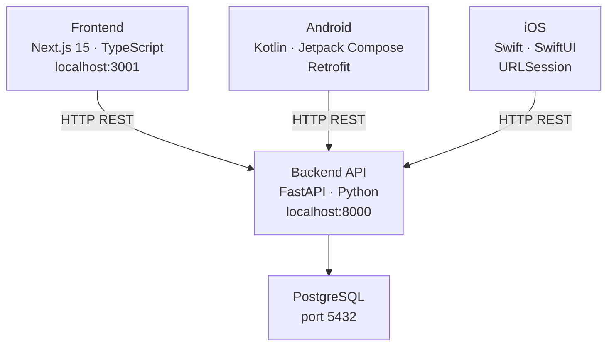

# Platziflix

Online course platform built as part of the Platzi Cursor IDE course. Three independent clients share a single REST API.

## Architecture



## Running locally

### Backend

Requires Docker. All commands run from `Backend/`.

```bash
make start           # start API + PostgreSQL containers
make migrate         # run Alembic migrations
make seed            # load sample data
make logs            # tail container logs
make stop            # stop containers
```

API will be available at `http://localhost:8000`.  
Interactive docs: `http://localhost:8000/docs`.

**Environment variables** (set in `docker-compose.yml`, override with `.env`):

| Variable | Default |
|---|---|
| `DATABASE_URL` | `postgresql://platziflix_user:platziflix_password@db:5432/platziflix_db` |

### Frontend

Requires Node.js ≥ 18 and Yarn. Run from `Frontend/`.

```bash
yarn install
yarn dev     # http://localhost:3000
```

Expects the Backend API at `http://localhost:8000`.

### Android

Open `Mobile/PlatziFlixAndroid/` in Android Studio. The API base URL is set in `NetworkModule.kt`:
- Emulator: `http://10.0.2.2:8000/`
- Physical device: replace with your machine's local IP

Toggle mock data in `AppModule.kt`: `USE_MOCK_DATA = true/false`.

### iOS

Open `Mobile/PlatziFlixiOS/PlatziFlixiOS.xcodeproj` in Xcode and run on simulator or device.

---

## API contract

| Endpoint | Description |
|---|---|
| `GET /health` | Service + DB status |
| `GET /courses` | List all courses |
| `GET /courses/{slug}` | Course detail with teachers and classes |

Course list item:
```json
{ "id": 1, "name": "Curso de React", "description": "...", "thumbnail": "https://...", "slug": "curso-de-react" }
```

Course detail adds `"teacher_id": [1, 2]` and `"classes": [{ "id", "name", "description", "slug" }]`.

Full contract: [`Backend/specs/00_contracts.md`](Backend/specs/00_contracts.md)

---

## Data model

All entities include `created_at`, `updated_at`, `deleted_at` (soft delete).

```
Course ──< CourseTeacher >── Teacher
  │
  └──< Lesson
```

## Project structure

```
├── Backend/          FastAPI app, Docker, Alembic migrations
│   ├── app/
│   │   ├── core/     settings
│   │   ├── db/       engine, session, seed
│   │   ├── models/   SQLAlchemy ORM
│   │   └── services/ business logic
│   └── specs/        API contracts
├── Frontend/         Next.js App Router
│   └── src/
│       ├── app/      pages (/, /course/[slug], /classes/[id])
│       ├── components/
│       └── types/    shared TS interfaces
└── Mobile/
    ├── PlatziFlixAndroid/   Kotlin · MVVM · Hilt
    └── PlatziFlixiOS/       Swift · SwiftUI · Clean Architecture
```